# Projektdokumentation - Travelyt

## Inhaltsverzeichnis

1. [Ausgangslage](#1-ausgangslage)
2. [Lösungsidee](#2-lösungsidee)
3. [Vorgehen & Artefakte](#3-vorgehen--artefakte)
    1. [Understand & Define](#31-understand--define)
    2. [Sketch](#32-sketch)
    3. [Decide](#33-decide)
    4. [Prototype](#34-prototype)
    5. [Validate](#35-validate)
4. [Erweiterungen [Optional]](#4-erweiterungen-optional)
5. [Projektorganisation [Optional]](#5-projektorganisation-optional)
6. [KI-Deklaration](#6-ki-deklaration)
7. [Anhang [Optional]](#7-anhang-optional)

> **Hinweis:** Massgeblich sind die im **Unterricht** und auf **Moodle** kommunizierten Anforderungen.

<!-- WICHTIG: DIE KAPITELSTRUKTUR DARF NICHT VERÄNDERT WERDEN! -->

<!-- Diese Vorlage ist für eine README.md im Repository gedacht. Abschnitte mit [Optional] können weggelassen werden, wenn in den Übungen nichts anderes verlangt wird. -->

## 1. Ausgangslage
Gruppenreisen werden heute oft über mehrere Tools gleichzeitig koordiniert — WhatsApp für Absprachen, Excel für Kosten, Notizen für Packlisten. Das führt zu Unübersichtlichkeit, vergessenen Aufgaben und Mehraufwand. Travelyt löst dieses Problem mit einer zentralen Web-App, die alle Planungsbereiche einer Gruppenreise an einem Ort bündelt. Die Lösung richtet sich an Reisegruppen (Freunde, Paare, Familien), die Aktivitäten, Ausgaben und Packlisten gemeinsam koordinieren wollen.

- **Problem:** Gruppenreisen erfordern die Abstimmung vieler Beteiligter über Aktivitäten, Ausgaben, Packlisten und Kommunikation. Diese sind heute auf mehrere Apps und Chats verteilt, was zu Informationsverlust und Koordinationsaufwand führt.

- **Ziele:** Entwicklung eines funktionalen Web-Prototyps, mit dem Gruppenreisen strukturiert geplant und verwaltet werden können. Mehrere Personen sollen denselben Trip gemeinsam einsehen und bearbeiten können — von der Aktivitätsplanung über die Kostenteilung bis zur Packliste.

- **Primäre Zielgruppe:** Personen, die gemeinsam mit Freunden, Familie oder Partnern reisen und Aktivitäten, Kosten sowie Vorbereitungsschritte koordinieren wollen.


## 2. Lösungsidee
Beschreibt die Lösungsidee.

Travelyt ist eine Web-App zur zentralen Organisation von Gruppenreisen. Die Lösungsidee besteht darin, alle relevanten Planungsbereiche – von der Reiseübersicht über Aktivitäten, Packliste und Budget bis hin zu Karte, Wetter, Galerie und Gruppen-Chat – in einer einzigen Anwendung zu bündeln. Dadurch sollen Reisende nicht mehr zwischen mehreren Tools, Chats oder Dokumenten wechseln müssen. Im Zentrum steht die kollaborative Nutzung: Mehrere Personen können denselben Trip gemeinsam einsehen und bearbeiten.

- **Kernfunktionalität:**  Die zentrale Funktion ist das Erstellen und Verwalten von Trips. User können einen neuen Trip mit Titel, Reiseziel und Zeitraum anlegen. Trips mit mehreren Zwischenstopps werden durch eine Multi-Destination-Funktion unterstützt: Jede Station erhält ein eigenes Ziel und einen eigenen Zeitraum. Trips können über einen Einladungslink mit Mitreisenden geteilt werden, sodass alle Beteiligten Zugriff auf dieselben Informationen haben.

  Innerhalb eines Trips können Aktivitäten geplant und verwaltet werden, wie zum Beispiel Ausflüge, Restaurantbesuche oder Sehenswürdigkeiten. Jede Aktivität kann mit Titel, Datum, Uhrzeit, Ort, Kategorie und Beschreibung ergänzt werden.

  Die Packlisten-Funktion ermöglicht es, Einträge zu erfassen, abzuhaken und nach Kategorien zu organisieren. Es gibt zwei Arten von Listen: eine **geteilte Packliste**, die für alle Mitreisenden sichtbar ist und Gegenstände enthält, die jede Person individuell mitbringen muss (z. B. Kleider, Schuhe, Sonnenbrille). Jeder kann Einträge hinzufügen und alle profitieren davon, so muss niemand eine Packliste von Grund auf selbst erstellen. Jede Person hakt ihre eigenen Einträge für sich ab. Daneben gibt es eine **private Packliste**, die nur für die jeweilige Person sichtbar ist und persönliche Gegenstände enthält, die niemand sonst sehen soll.

  Die Budget-Funktion erlaubt das Erfassen von Ausgaben mit Betrag, Kategorie und Beschreibung. Bei jeder Ausgabe kann festgelegt werden, auf welche Personen die Kosten aufgeteilt werden, wobei nicht zwingend alle Mitreisenden beteiligt sein müssen. Die App berechnet automatisch, wer wem wie viel schuldet, und zeigt offene Salden übersichtlich an.

  Ergänzend stehen folgende Funktionen zur Verfügung: eine **Galerie** für gemeinsame Reisefotos, ein **Gruppen-Chat** für Absprachen innerhalb des Trips, eine **Checkliste** für reisebezogene Aufgaben, eine **Wettervorschau** pro Reiseziel sowie eine interaktive **Karte**, die Aktivitäten und Reisestationen visualisiert. Alle Trips sind ausserdem in einer **Kalenderansicht** dargestellt.

- **Abgrenzung:** Die gezielte Unterstützung von Solo-Reisen gehört nicht zum aktuellen Umfang des Prototyps. Solo-Nutzung ist zwar möglich, jedoch ist die Benutzeroberfläche (z. B. Ausgaben-Splitting, Mitglieder-Verwaltung, Gruppen-Chat) auf gemeinsame Reisen ausgerichtet. Eine UI-Anpassung für Solo-Reisende ist als zukünftige Erweiterung geplant. Der Prototyp wurde zudem ausschliesslich als Desktop-Web-App entwickelt und ist nicht für mobile Geräte optimiert. Eine native Mobile App ist für einen späteren Entwicklungsschritt vorgesehen.

## 3. Vorgehen & Artefakte
Die Durchführung erfolgt phasenbasiert; dokumentieren Sie die wichtigsten Ergebnisse je Phase.

### 3.1 Understand & Define
- **Zielgruppenverständnis:** Im Rahmen einer informellen Zielgruppenanalyse wurden drei typische Usergruppen identifiziert, für die gemeinsame Reiseplanung besonders relevant ist:
  - **Freundesgruppen** (z. B. Studierende oder junge Berufstätige): planen Reisen gemeinsam, teilen sich Kosten, haben aber oft unklare Absprachen über Aktivitäten und Budget
  - **Paare**: reisen häufig zusammen und möchten Planung und Ausgaben unkompliziert koordinieren
  - **Familien**: benötigen vor allem Übersicht über Packlisten und gemeinsame Aktivitäten; mehrere Personen müssen koordiniert werden

- **Wesentliche Erkenntnisse:**
  - Reisende nutzen heute mehrere Tools parallel (WhatsApp, Notes, Excel, Splitwise), was zu Informationsverlust und Mehraufwand führt
  - Es gibt viele Reise-Apps, aber kaum eine, die Aktivitäten, Ausgaben, Packliste, Kommunikation und Karte in einem vereint, sodass User zwischen mehreren Apps wechseln müssen
  - Apps wie Splitwise lösen das Ausgabenproblem, haben aber keinen Reisekontext; Google Maps und Kalender-Apps fehlt die kollaborative Planungsebene
  - Bei Gruppenreisen ist die Kostenteilung ein zentrales Frustrationspotenzial
  - Packlisten werden oft mündlich oder in Chat-Gruppen koordiniert und häufig vergessen
  - WhatsApp-Gruppen sind für viele Reisegruppen das primäre Koordinationswerkzeug, obwohl wichtige Informationen dort schnell untergehen

### 3.2 Sketch

- **Variantenüberblick:**
  In der Sketch-Phase wurde gezielt ein card- und tab-basierter Ansatz erarbeitet. Da die App von Anfang an viele Funktionsbereiche abdecken sollte (Aktivitäten, Packliste, Budget, Galerie, Checkliste, Mitglieder, Wetter, Karte), wurde eine klare strukturelle Trennung über Tabs als einzig sinnvoller Ansatz identifiziert — eine rein scroll-basierte Variante wurde konzeptuell verworfen, da sie bei diesem Umfang schnell unübersichtlich wird, ohne sie formell auszuarbeiten.

  Die Sketch-Phase umfasste eine **Papier-Handskizze** mit einer groben Layoutidee für Dashboard, Trip-Detailseite mit Tabs und die wichtigsten Screens.

- **Skizzen:**

  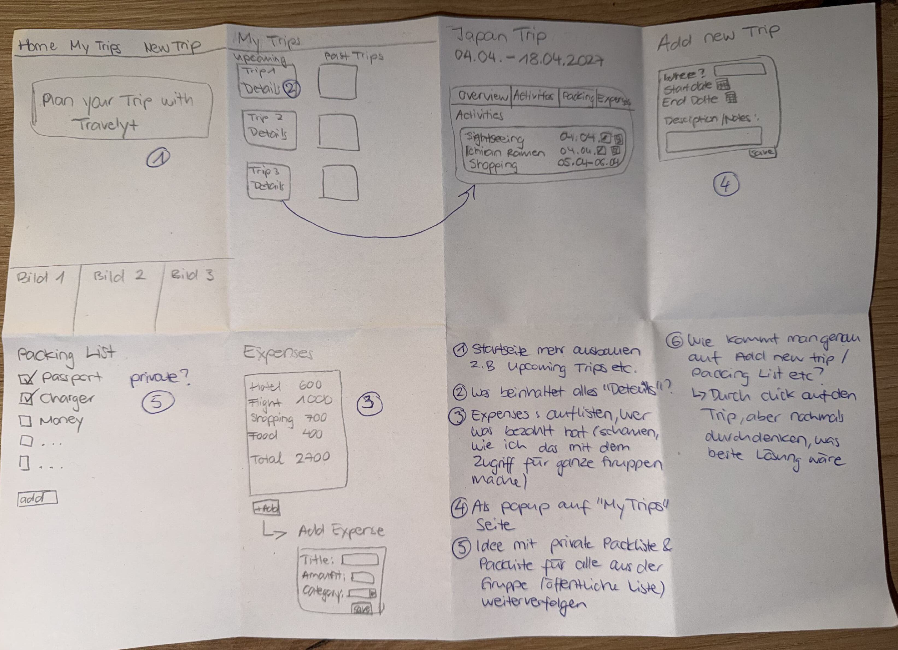

  Auf Basis der Handskizze wurde ein Wireframe in Figma erstellt, das die finale Struktur (Tab-Navigation, Dashboard-Layout, Trip-Karten) vorwegnimmt. Details zum Wireframe und zur getroffenen Entscheidung folgen in Abschnitt 3.3.

### 3.3 Decide
- **Gewählte Variante & Begründung:** Gewählt wurde ein **card- und tab-basiertes Layout** mit einer persistenten Kopfnavigation. Die Trip-Detailseite ist in acht Tabs unterteilt (Itinerary, Packing, Budget, Gallery, Checklist, Members, Weather, Map), um die vielen Funktionsbereiche übersichtlich zu strukturieren, ohne die Usern zu überfordern. Diese Variante wurde gegenüber einer rein listen- oder scroll-basierten Ansicht bevorzugt, da Tabs einen schnellen Kontextwechsel ermöglichen und der Umfang der Funktionen eine klare Trennung erfordert. Das Dashboard bietet eine kompakte Übersicht über den nächsten Trip, offene Salden und den Activity Feed, damit User sofort den relevantesten Inhalt sehen.

- **End-to-End-Ablauf:** Ein typischer Nutzungsfluss sieht wie folgt aus:
  1. **Registrierung / Login** – User erstellt einen Account oder meldet sich an
  2. **Trip erstellen** – Titel, Reiseziel(e) und Zeitraum werden erfasst; bei Mehrfachzielen können mehrere Stationen hinzugefügt werden
  3. **Mitglieder einladen** – ein Einladungslink wird generiert und geteilt; Mitreisende treten dem Trip über den Link bei
  4. **Aktivitäten planen** – alle Mitglieder können Aktivitäten mit Datum, Uhrzeit, Ort, Kategorie und Beschreibung erfassen
  5. **Packliste befüllen** – Einträge werden in der geteilten Liste ergänzt; jede Person hakt ihre eigenen Sachen ab; persönliche Gegenstände kommen in die private Liste
  6. **Ausgaben erfassen** – Kosten werden mit Betrag, Kategorie und Aufteilung auf ausgewählte Personen eingetragen
  7. **Während der Reise** – Fotos in die Galerie hochladen, im Gruppen-Chat kommunizieren, Checkliste abhaken
  8. **Abschluss** – offene Salden einsehen und Schulden begleichen

- **Mockup:** Das Wireframe wurde eigenständig in Figma erstellt: [Travelyt – Figma Wireframe](https://www.figma.com/proto/eGOPITLXT65c9L0HnifHD1/Travelyt-Prototype?node-id=2-5&starting-point-node-id=3%3A85&t=yd1KnFcDivep3yxE-1)

  Figma Make diente dabei als Inspirationsquelle für einzelne Layoutideen. Das Wireframe zeigt die grundlegende Layoutstruktur mit Tab-Navigation auf der Trip-Detailseite und dem Dashboard-Aufbau. Einzelne Details (z. B. zusätzliche Tabs, Farbgebung, Formularfelder) haben sich im Verlauf der Umsetzung weiterentwickelt und weichen vom ursprünglichen Wireframe ab.

  > Die folgenden Screenshots stammen aus **Figma Make** und dienten als Inspiration — es handelt sich nicht um die eigenständig erstellten Wireframes (siehe Link oben).

  **My Trips – Übersicht**
  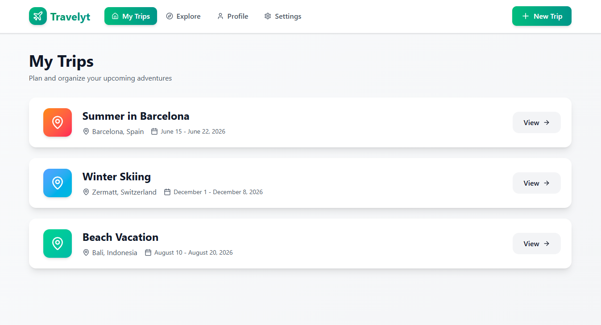

  **Trip erstellen – Formular**
  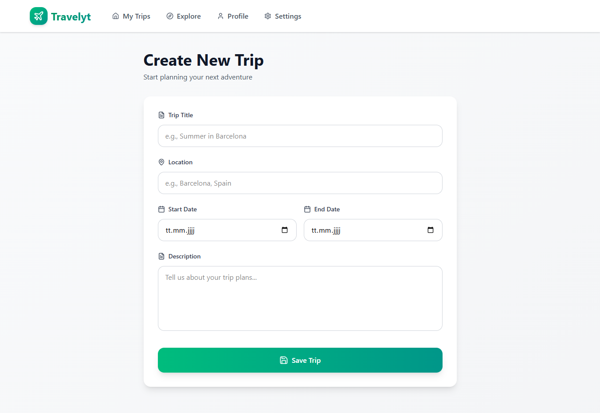

  **Trip-Detail – Übersicht**
  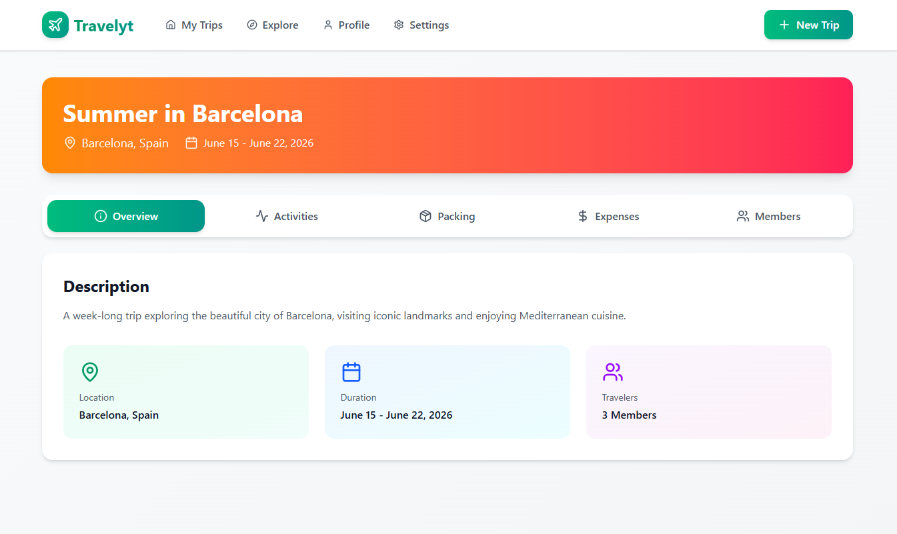

  **Ausgaben (Budget)**
  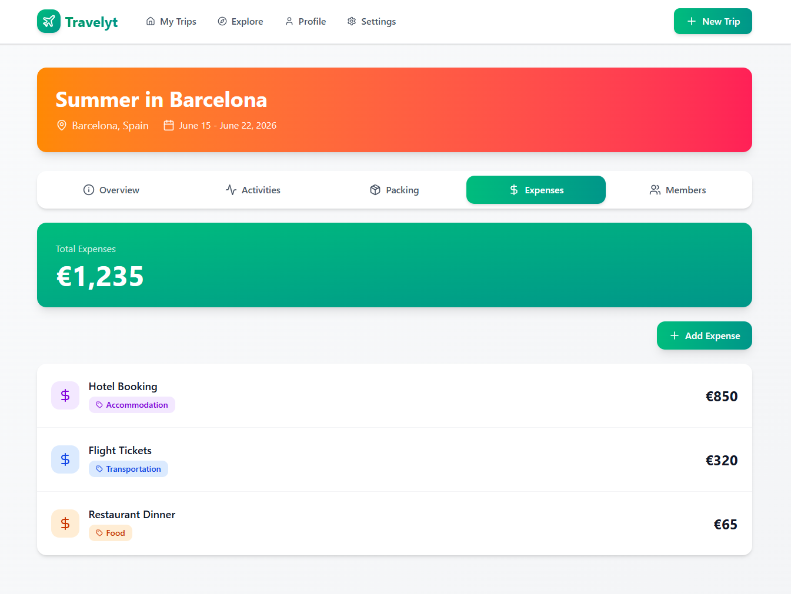

### 3.4 Prototype

#### 3.4.1. Entwurf (Design)
Beschreibt die Gestaltung und Interaktion.
> **Hinweis:** Hier wird der **Prototyp** beschrieben, nicht das **Mockup**.
- **Informationsarchitektur:** Die App ist in drei Hauptbereiche gegliedert, die über eine persistente Kopfnavigation erreichbar sind:
  - **Dashboard** – Übersicht mit dem nächsten Trip, offenen Salden und dem Activity Feed
  - **My Trips** – Listenansicht aller eigenen Trips; Erstellen neuer Trips; Detail-Ansicht mit acht Tabs (Activities, Packing, Budget, Gallery, Checklist, Members, Weather, Map)
  - **Calendar** – Monatskalender, der alle Trips als farbige Balken darstellt; Erstellen neuer Trips direkt aus dem Kalender
  - Zusätzlich gibt es in der Navigation ein **Bell-Icon** (Activity Feed / Notifications), das tripübergreifend Aktivitäten anzeigt, sowie ein **Avatar-Menü** mit Zugriff auf Profile, Settings und Logout

  **Navigationsstruktur:**

  ```mermaid
  flowchart TD
      AUTH["/auth\nLogin / Registrierung"]
      AUTH --> DASH

      subgraph MAINNAV["Hauptnavigation (Header)"]
          DASH["/ — Dashboard"]
          TRIPS["/trips — My Trips"]
          CAL["/calendar — Kalender"]
      end

      DASH --- TRIPS
      DASH --- CAL
      TRIPS --> DETAIL["/trips/[tripId]\nTrip-Detail"]

      subgraph TABS["Tab-Navigation (Trip-Detail)"]
          T1[Activities]
          T2[Packing]
          T3[Budget]
          T4[Gallery]
          T5[Checklist]
          T6[Members]
          T7[Weather]
          T8[Map]
      end

      DETAIL --> TABS
      DETAIL --> PRINT["/trips/[tripId]/print\nDruckansicht"]

      DASH -.->|Avatar-Menü| PROFILE["/profile — Profil"]
      DASH -.->|Avatar-Menü| SETTINGS["/settings — Einstellungen"]

      JOIN["/trips/join/[code]\nEinladungslink"] --> DETAIL
      PENDING["/join/pending\nWarteseite"] -.->|nach Login| DETAIL
  ```

- **User Interface Design:**

  **Dashboard**
  Das Dashboard zeigt beim Öffnen der App sofort die relevantesten Informationen: einen Countdown zum nächsten Trip (Karussell mit allen bevorstehenden Reisen), offene Salden quer über alle Trips sowie den Activity Feed mit den neuesten Aktivitäten aller Mitreisenden. Oben rechts befinden sich das Bell-Icon (Notifications) und das Avatar-Menü.

  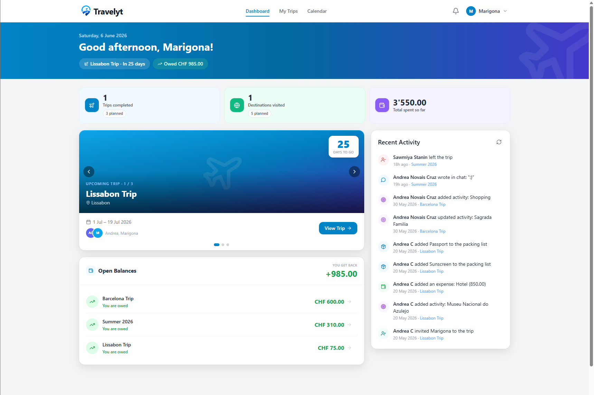

  **My Trips – Übersicht**
  Die My-Trips-Seite zeigt alle eigenen Trips als Karten mit Titel, Reiseziel, Zeitraum und Status (upcoming/ongoing/past). Über einen Button kann direkt ein neuer Trip erstellt werden.

  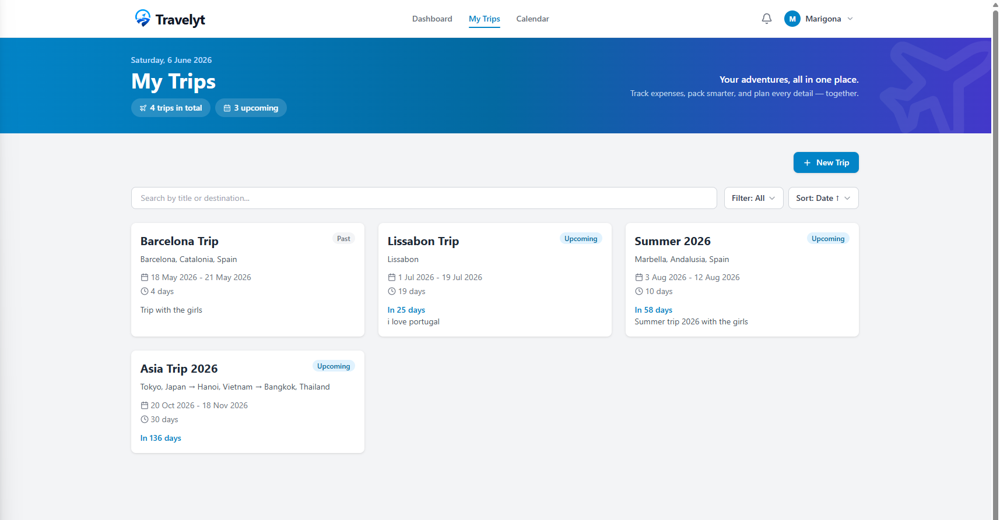

  **Trip-Detail – Activities**
  Die Trip-Detailseite öffnet standardmässig den Activities-Tab. Aktivitäten sind tagesweise gruppiert und können mit Titel, Datum, Uhrzeit, Ort und Kategorie erfasst werden. Über das Options-Menü (oben rechts) lässt sich der Trip als PDF exportieren. Das Bearbeiten und Löschen des Trips ist nur dem Owner vorbehalten.

  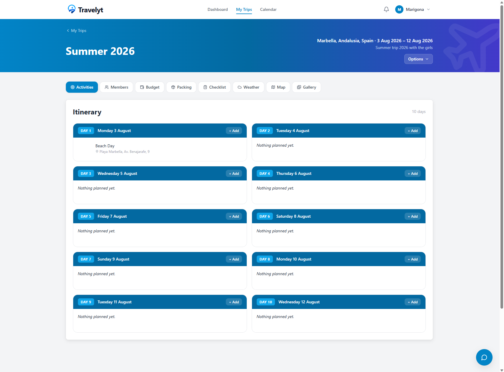

  **Budget-Tab – Ausgaben**
  Im Budget-Tab werden Ausgaben mit Betrag, Kategorie, Datum und Aufteilung auf ausgewählte Mitreisende erfasst und als Liste dargestellt.

  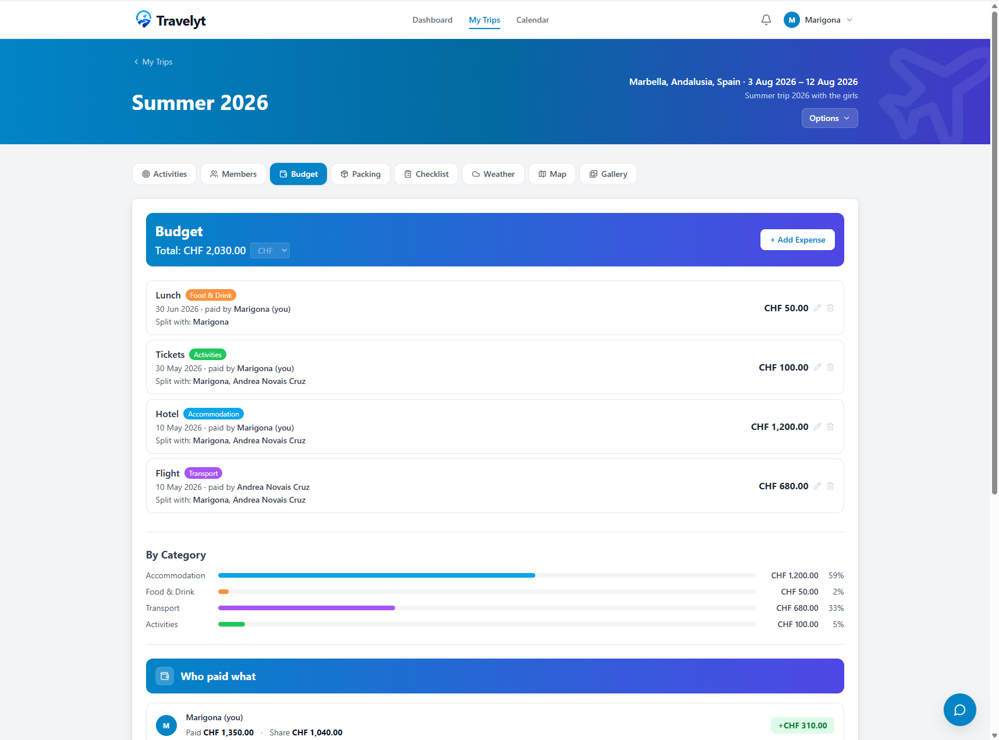

  **Budget-Tab – Schuldenabrechnung**
  Die App berechnet automatisch, wer wem wie viel schuldet, und zeigt die offenen Salden übersichtlich an. Begleichungen können direkt erfasst werden.

  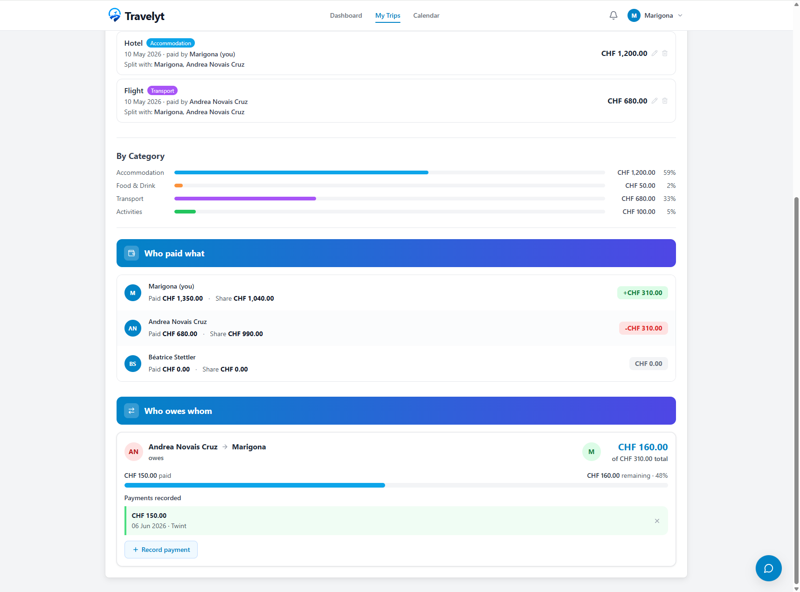

  **Packliste**
  Die Packliste unterscheidet zwischen einer geteilten Liste (für alle sichtbar, jede Person hakt ihre eigenen Einträge ab) und einer privaten Liste (nur für die eigene Person sichtbar). Einträge können per Undo-Toast (5 Sekunden) rückgängig gemacht werden.

  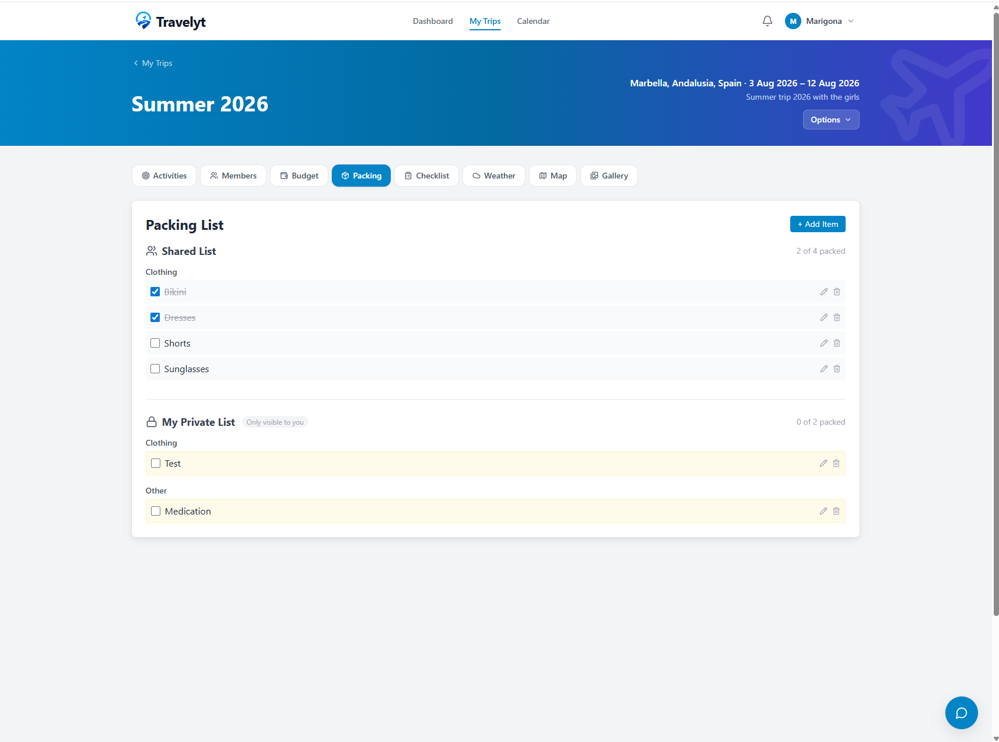

  **Galerie**
  Im Gallery-Tab können alle Mitreisenden Fotos hochladen, die gemeinsam angezeigt werden. Bilder lassen sich in einer Vollbild-Ansicht öffnen und vom Uploader wieder löschen.

  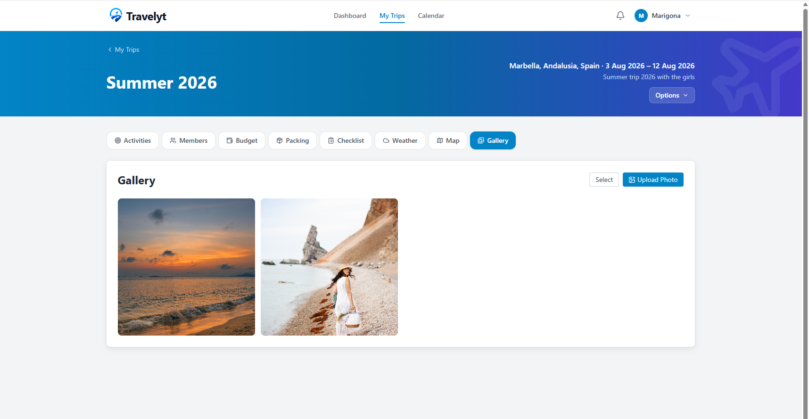

  **Checkliste**
  Der Checklist-Tab enthält reisebezogene Aufgaben (z. B. Dokumente organisieren, Versicherung abschliessen). Einträge können abgehakt und per Undo-Toast gelöscht werden. Vorschläge helfen beim schnellen Befüllen der Liste.

  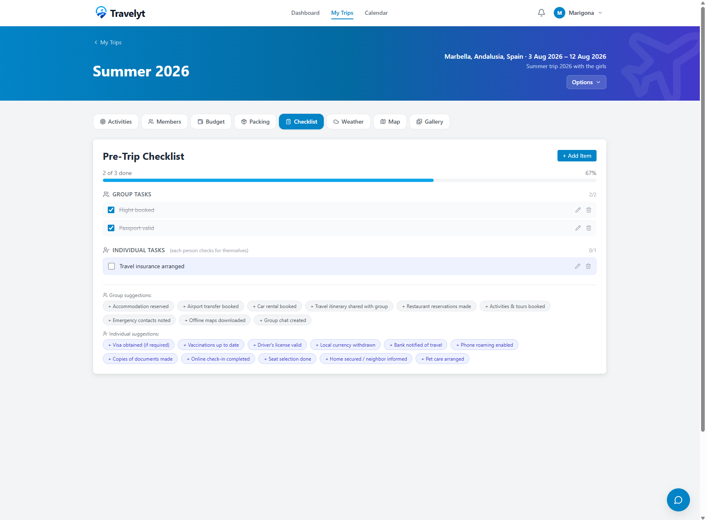

  **Mitglieder**
  Der Members-Tab zeigt alle Mitreisenden mit ihrer Rolle (Owner / Member). Der Trip-Besitzer kann Mitglieder entfernen, Eigentumsrechte übertragen und einen Einladungslink generieren oder widerrufen.

  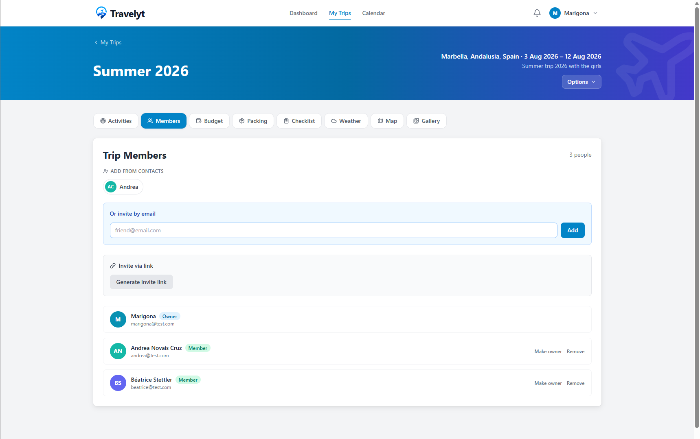

  **Gruppen-Chat**
  Der Trip-Chat ist als schwebendes Panel (floating button, unten rechts) auf der Trip-Detailseite verfügbar. Mitreisende können in Echtzeit Nachrichten austauschen. Ungelesene Nachrichten werden mit einem roten Badge angezeigt; neue Nachrichten werden alle 5 Sekunden automatisch abgerufen.

  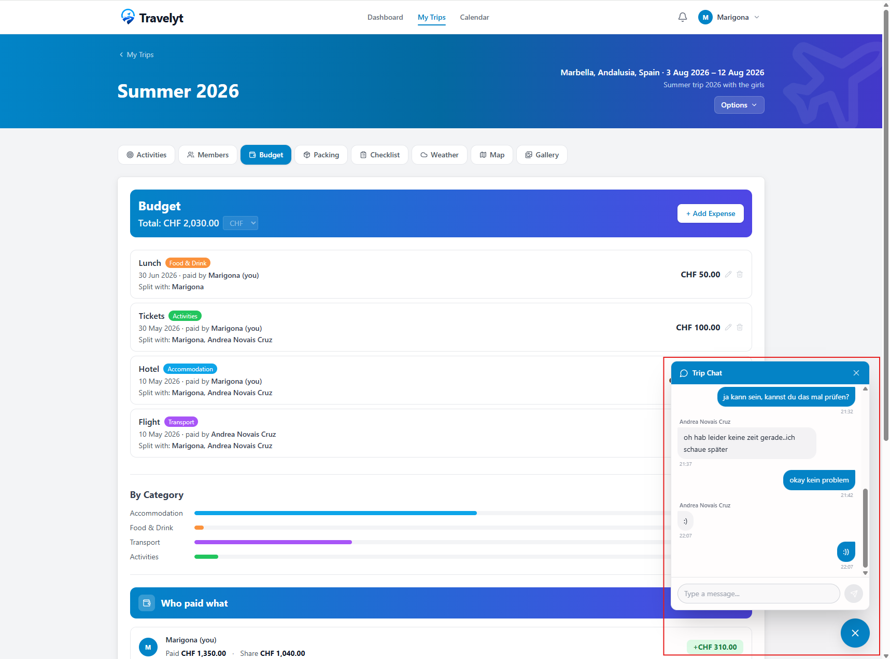

  **Karte**
  Der Map-Tab zeigt alle Aktivitäten und Reisestationen auf einer interaktiven Karte (MapLibre GL / OpenStreetMap). Aktivitäten erscheinen als Pins und können direkt angeklickt werden.

  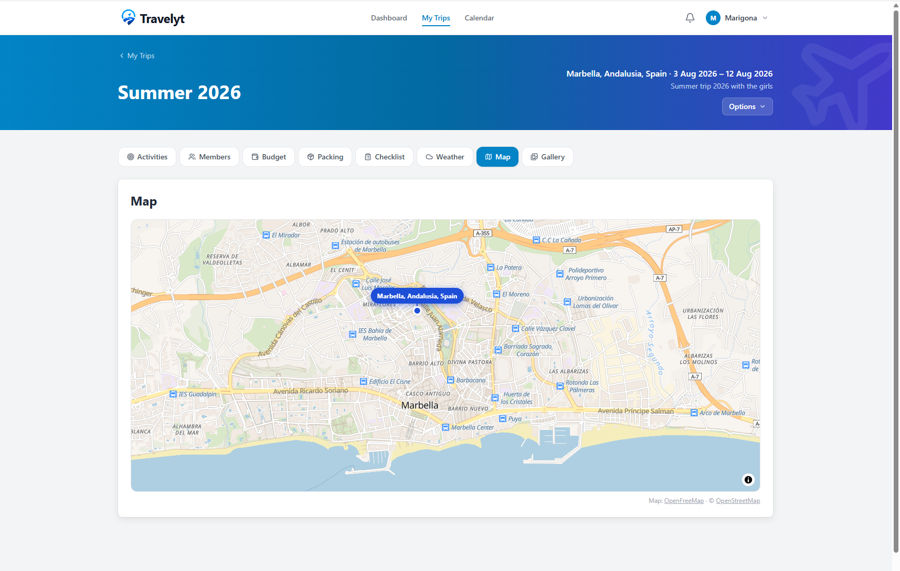

  **Wetter**
  Der Weather-Tab zeigt die Wettervorhersage pro Reiseziel für bis zu 16 Tage im Voraus sowie historische Wetterdaten für vergangene Trips. Bei Multi-Destination-Trips kann zwischen den einzelnen Stationen gewechselt werden.

  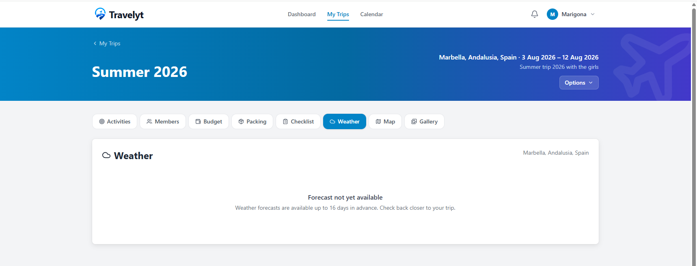

- **Designentscheidungen:**
  - **Tailwind CSS** für konsistentes, utility-first Styling ohne separate CSS-Dateien
  - **Dark Mode** über localStorage persistiert; systemweite Unterstützung via CSS-Klasse auf `<html>`
  - **Tab-basierte Navigation** im Trip-Detail, um die vielen Funktionsbereiche eines Trips übersichtlich zu halten
  - **Inline-Bestätigung** statt Browser-`confirm()` für Löschaktionen, um ein einheitliches UI-Erlebnis zu gewährleisten
  - **Toast + Undo** (5 Sekunden) für weniger kritische Löschaktionen (Aktivitäten, Packlisteneinträge, Checklisteneinträge), um versehentliche Löschungen rückgängig machen zu können
  - **Onboarding-Tour** beim ersten Login, die interaktiv durch die wichtigsten Navigationspunkte führt

#### 3.4.2. Umsetzung (Technik)
Fasst die technische Realisierung zusammen.
- **Technologie-Stack:**
  - **Framework:** SvelteKit 5 mit Svelte 5 Runes (`$state`, `$derived`, `$props`, `$effect`)
  - **Sprache:** JavaScript (kein TypeScript)
  - **Styling:** Tailwind CSS
  - **Datenbank:** MongoDB Atlas (NoSQL, Cloud-gehostet)
  - **Icons:** lucide-svelte
  - **Authentifizierung:** Eigene Implementierung mit bcryptjs (Passwort-Hashing), Session via HTTP-Cookie (`userId`)
  - **Karten:** MapLibre GL (OpenFreeMap-Tiles, OpenStreetMap-Daten), Geocoding via Nominatim
  - **Wetter:** Open-Meteo API (kostenlos, kein API-Key erforderlich); historische Wetterdaten via Open-Meteo Archive API
  - **Standortsuche:** Open-Meteo Geocoding API für Destination-Autocomplete

- **Tooling:**
  - **IDE:** Visual Studio Code mit Svelte- und ESLint-Erweiterungen
  - **Versionskontrolle:** Git / GitHub
  - **Lokale Entwicklung:** Node.js, `npm run dev`
  - **Datenbank-Verwaltung:** MongoDB Atlas Web UI
  - **Issue-Tracking:** GitHub Issues (für Bugfixes und Feature-Planung während der Entwicklung)
  - **Diagramme:** draw.io (Architekturdiagramm)

- **Architekturübersicht:**

  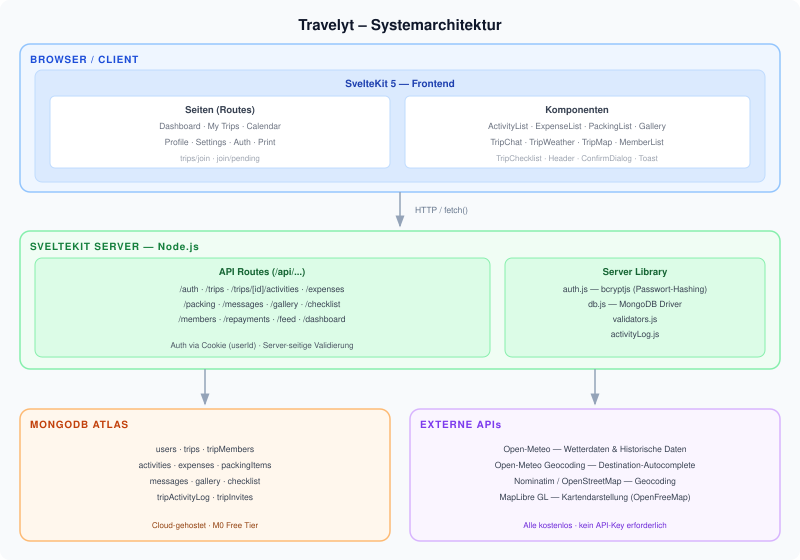

- **Struktur & Komponenten:**
  - **Routen (Seiten):**

    | Route | Seite | Beschreibung |
    |---|---|---|
    | `/auth` | Login / Registrierung | Registrierung und Login per E-Mail & Passwort |
    | `/` | Dashboard | Nächste Trips, offene Salden, Activity Feed |
    | `/trips` | My Trips | Alle Trips als Karten; Erstellungsformular |
    | `/trips/[tripId]` | Trip-Detail | Tab-Navigation mit 8 Tabs (Activities, Packing, Budget, Gallery, Checklist, Members, Weather, Map) |
    | `/trips/[tripId]/print` | Druckansicht | Druckoptimierte Ansicht für PDF-Export |
    | `/calendar` | Kalender | Monatskalender mit allen Trips als Balken |
    | `/profile` | Profil | Name, E-Mail und Profilfoto bearbeiten |
    | `/settings` | Einstellungen | Dark Mode, Benachrichtigungs-Präferenzen |
    | `/trips/join/[code]` | Einladungslink | Tritt einem Trip über einen Einladungscode bei |
    | `/join/pending` | Warteseite | Zwischenseite für nicht eingeloggte User beim Öffnen eines Einladungslinks |
  - **API-Routen** unter `src/routes/api/` für alle Datenzugriffe (trips, activities, expenses, packing, gallery, members, messages, feed, dashboard, auth, user)
  - **Wiederverwendbare Komponenten** unter `src/lib/components/`: `Header`, `PageHeader`, `TripCard`, `ActivityList`, `ExpenseList`, `PackingList`, `MemberList`, `Gallery`, `TripChat`, `TripWeather`, `TripMap`, `TripChecklist`, `ActivityFeed`, `DestinationInput`, `OnboardingTour`, `Toast`, `ConfirmDialog`
  - **State-Management:** Ausschliesslich lokales Komponentenstate via Svelte 5 Runes; kein globaler Store

- **Daten & Schnittstellen:**
  - Alle Daten werden in **MongoDB Atlas** gespeichert. Die wichtigsten Collections sind: `users`, `trips`, `tripMembers`, `tripInvites`, `activities`, `expenses`, `packingItems`, `messages`, `gallery`, `checklist`, `tripActivityLog`
  - **API-Kommunikation:** REST-API über SvelteKit Server Routes (`+server.js`); alle Anfragen erfolgen mit `fetch()` im Client
  - **Authentifizierung:** Passwörter werden mit bcryptjs gehasht gespeichert. Nach Login wird ein `userId`-Cookie gesetzt, das bei jeder API-Anfrage serverseitig geprüft wird
  - **Bilder** (Profilfotos, Galerie) werden als Base64-Strings direkt in MongoDB gespeichert (Prototyp-Entscheidung; für Produktion wäre Cloudinary o. Ä. sinnvoll)
  - **Echtzeit:** Kein WebSocket; Updates erfolgen per Polling: Activity Feed alle 12 Sekunden, Chat alle 5 Sekunden (wenn geöffnet) bzw. alle 8 Sekunden (wenn geschlossen)

- **Deployment:** _[URL folgt]_

- **Besondere Entscheidungen:**
  - **Base64-Bildspeicherung in MongoDB:** Für den Prototyp wurde auf einen externen Bildhosting-Dienst verzichtet. Bilder werden direkt als Base64 in der Datenbank gespeichert. Dies vereinfacht die Umsetzung, ist aber für den Produktiveinsatz nicht skalierbar.
  - **Kein TypeScript:** Bewusste Entscheidung zugunsten schnellerer Entwicklung im Prototyp-Kontext.
  - **Polling statt WebSockets:** Echtzeit-Updates im Chat und Feed erfolgen über regelmässiges Polling statt über eine persistente WebSocket-Verbindung, da dies für einen Prototyp deutlich einfacher umzusetzen ist.
  - **Multi-Destination als Legs:** Trips mit mehreren Zielen werden über ein `legs`-Array im Trip-Dokument abgebildet. Ältere Trips ohne `legs` werden beim Lesen automatisch normalisiert (Rückwärtskompatibilität).

### 3.5 Validate
- **URL der getesteten Version:** https://travelyt-v2.netlify.app/

  > **Hinweis:** Die automatischen Deploys auf Netlify waren zum Zeitpunkt des Usability-Tests versehentlich noch aktiv. Nach dem Test wurden Änderungen am Prototyp vorgenommen, die dadurch automatisch live gegangen sind. Die unter dieser URL verfügbare Version entspricht daher möglicherweise nicht exakt dem Zustand zum Testzeitpunkt. Die Dokumentation in diesem Kapitel beschreibt korrekt den Zustand während des Tests.

- **Ziele der Prüfung:**
  - Verstehen Testpersonen ohne Erklärung, was die App macht und wie man startet?
  - Ist die Erstellung einer Reise (Trip) intuitiv und selbsterklärend?
  - Finden User die verschiedenen Tabs (Aktivitäten, Ausgaben, Packliste, Mitglieder) eigenständig?
  - Ist das Konzept der kollaborativen Reise (Mitglieder einladen) verständlich?
  - Wird die Benachrichtigungsglocke (Activity Feed) wahrgenommen?

- **Vorgehen:** Die Evaluation wurde unmoderiert und on-site durchgeführt. Die Testpersonen navigierten selbstständig durch die App, während beobachtet und Notizen gemacht wurden. Erst wenn eine Person erkennbar verunsichert oder blockiert war, wurde eingegriffen und eine kurze Erklärung gegeben.

- **Stichprobe:** 2 Personen aus dem gleichen Studiengang (Kommilitonen), mit grundlegenden Smartphone- und Web-App-Kenntnissen. Keine Vorerfahrung mit Travelyt.

- **Aufgaben/Szenarien:**

  **Testaufgabe 1 – Registrierung & Login**
  Sie sind eine reisebegeisterte Person und haben von einer neuen App zur gemeinsamen Reiseplanung gehört. Sie wollen die App ausprobieren und sich einen ersten Überblick verschaffen.
  - Aufgabe 1: Sie möchten ein Konto erstellen (Fake-E-Mail möglich) und sich anschliessend in der App anmelden.

  **Testaufgabe 2 – Reise erstellen**
  Sie planen gemeinsam mit Freunden eine Reise nach Lissabon im kommenden September. Sie wollen die Reise in der App festhalten, damit alle Mitreisenden darauf zugreifen können.
  - Aufgabe 1: Sie möchten eine neue Reise mit dem Titel «Lissabon», dem Reiseziel und den Reisedaten.
  - Aufgabe 2: Nachdem Sie die Reise angelegt haben, laden Sie marigona@test.com als Member ein (Mitreisende).

  **Testaufgabe 3 – Aktivität hinzufügen**
  Ihre Reise nach Lissabon ist angelegt. Sie wollen nun die erste gemeinsame Aktivität einplanen. Sie möchten, dass alle Mitreisenden die geplante Aktivität in der App sehen können.
  - Aufgabe 1: Sie möchten einen Besuch im «Museu Nacional do Azulejo» am ersten Reisetag als Aktivität zur Reise hinzufügen. Prüfen Sie, ob die Aktivität in der Reiseübersicht erscheint.

  **Testaufgabe 4 – Ausgabe erfassen**
  Sie haben die Hotelkosten übernommen und Marigona hat die Flugkosten übernommen. Sie wurden gebeten, die Kosten in der App zu erfassen. Sie wollen die Ausgabe für alle Mitreisenden sichtbar dokumentieren.
  - Aufgabe 1: Sie möchten eine Ausgabe von CHF 850 für «Hotel» in der Reise eintragen.
  - Aufgabe 2: Sie möchten prüfen, ob die Ausgabe korrekt in der Liste erscheint (who owes whom).

  **Testaufgabe 5 – Packliste**
  Sie bereiten sich auf die Abreise vor und wollen sichergehen, nichts Wichtiges zu vergessen. Sie möchten die Packliste in der App nutzen, um sich zu organisieren.
  - Aufgabe 1: Sie möchten drei Gegenstände zur Packliste hinzufügen (z. B. Passport, Sunscreen, Charger). Zur Private List fügen Sie «Medication» hinzu.
  - Aufgabe 2: Sie möchten einen dieser Einträge als «erledigt» markieren, nachdem Sie ihn eingepackt haben.

  **Testaufgabe 6 – Activity Feed (Benachrichtigungen)**
  Sie sind auf der Detailseite Ihrer Reise und bemerken ein Symbol oben in der Navigation. Sie sind neugierig, was dieses Symbol bedeutet.
  - Aufgabe 1: Sie möchten herausfinden, was sich hinter dem Glocken-Symbol verbirgt, und es öffnen.
  - Aufgabe 2: Sie möchten die angezeigten Informationen lesen und einschätzen, wozu diese nützlich sind.

- **Kennzahlen & Beobachtungen:**

  | # | Beobachtung | Schwere |
  |---|---|---|
  | 1 | Das Feld „Währung" beim Erstellen eines Trips war für beide Testpersonen unklar — sie wussten nicht, warum es dort erscheint und was es bewirkt | Mittel |
  | 2 | Das Datumsfeld beim Erfassen einer Ausgabe im Budget-Tab war missverständlich — unklar, ob Reisedatum oder Ausgabedatum gemeint ist | Gering |
  | 3 | Private Packlisteneinträge waren zum Testzeitpunkt für alle Mitglieder sichtbar (Bug) | Hoch |
  | 4 | Die Bearbeitung von Ausgaben war zum Testzeitpunkt nicht möglich (nur Löschen) — Testpersonen versuchten einen Betrag zu korrigieren | Mittel |
  | 5 | Der Button zum Hinzufügen von Aktivitäten wurde als zu weit vom jeweiligen Tag entfernt empfunden — Wunsch, direkt beim Tag hinzuzufügen | Gering |

- **Zusammenfassung der Resultate:** Die Grundfunktionen (Trip erstellen, Aktivitäten, Navigation) wurden von beiden Testpersonen selbstständig und ohne Probleme gefunden. Eine Unsicherheit zeigte sich bereits beim Erstellen eines Trips: Das Feld «Währung» war für beide Testpersonen unverständlich platziert. Im Budget-Tab war das Datumsfeld missverständlich beschriftet. Ein kritischer Bug wurde entdeckt: Private Packlisteneinträge waren für alle Mitglieder sichtbar. Die Tab-Navigation wurde als übersichtlich und verständlich bewertet.

- **Abgeleitete Verbesserungen:**
  1. **Bug: Private Packliste sichtbar** — Private Einträge werden nun serverseitig gefiltert und nur dem Ersteller angezeigt _(umgesetzt → siehe Kap. 4)_
  2. **Budget: Ausgabe bearbeiten** — Die Bearbeitungsfunktion für Ausgaben wurde implementiert _(umgesetzt → siehe Kap. 4)_
  3. **Währungsfeld beim Trip-Erstellen verwirrend** — Das Währungsfeld wurde aus dem Erstellungsformular entfernt und direkt in den Budget-Tab integriert, wo es kontextuell sinnvoll ist _(umgesetzt → siehe Kap. 4)_
  4. **Activities: Direktes Hinzufügen pro Tag** — Aktivitäten können nun direkt innerhalb des jeweiligen Tages hinzugefügt werden, ohne den globalen Button nutzen zu müssen _(umgesetzt → siehe Kap. 4)_
  5. **Budget: Datumsfeld klarer beschriften** — Statt das Label umzubenennen wurde ein Info-Icon (ℹ) direkt neben dem Datumsfeld eingefügt. Beim Hovern erscheint ein Tooltip, der erklärt, dass das Ausgabedatum gemeint ist _(umgesetzt → siehe Kap. 4)_
  6. **Galerie für gemeinsame Reisefotos** — Im Anschluss an den Usability-Test entstand die Idee, einen Gallery-Tab zu ergänzen, in dem alle Mitreisenden Fotos des Trips hochladen und gemeinsam anschauen können _(umgesetzt → siehe Kap. 4)_

## 4. Erweiterungen [Optional]
Dokumentiert Erweiterungen über den Mindestumfang hinaus.
> **Hinweis:** Jede Erweiterung ist separat nach dem folgenden Schema zu beschreiben.

### 4.1 Login & Registrierung (Authentifizierung)
- **Beschreibung & Nutzen:** User können sich mit E-Mail und Passwort registrieren und anmelden. Passwörter werden sicher mit bcryptjs gehasht gespeichert. Nach erfolgreichem Login wird ein `userId`-Cookie gesetzt, das bei jeder API-Anfrage serverseitig geprüft wird. Ohne gültige Session ist kein Zugriff auf Trips oder Daten möglich.
- **Wo umgesetzt:**
  - **Frontend:** `src/routes/auth/+page.svelte` — kombiniertes Login-/Registrierungsformular
  - **Backend:** `src/routes/api/auth/+server.js` — Passwort-Hashing, Cookie-Setzen, Session-Prüfung
  - **Datenbank:** Collection `users` (Felder: `email`, `name`, `password` [gehasht])
- **Referenz:** Kap. 3.4.2 (Authentifizierung); Testaufgabe 1 in Kap. 3.5
- **Aus Evaluation abgeleitet?:** Nein

### 4.2 Dashboard
- **Beschreibung & Nutzen:** Die Startseite der App zeigt sofort die relevantesten Informationen: ein Karussell mit bevorstehenden Trips inklusive Countdown bis zur Abreise, offene Salden quer über alle Trips sowie die neuesten Aktivitäten aller Mitreisenden im Activity Feed. So müssen User nicht erst in einzelne Trips navigieren, um den aktuellen Stand zu sehen.
- **Wo umgesetzt:**
  - **Frontend:** `src/routes/+page.svelte` — Dashboard-Seite mit Karussell, Saldo-Übersicht und Feed
  - **Backend:** `src/routes/api/dashboard/+server.js` — aggregiert Trip-Daten, Salden und Feed-Einträge
  - **Datenbank:** Collections `trips`, `expenses`, `tripActivityLog`, `tripMembers`
- **Referenz:** Kap. 3.4.1 (Dashboard-Screenshot), Kap. 2 (Kernfunktionalität)
- **Aus Evaluation abgeleitet?:** Nein

### 4.3 Kalenderansicht
- **Beschreibung & Nutzen:** Eine separate Kalenderseite zeigt alle Trips der Userin / des Users in einer Monatsansicht als farbige Balken. So lässt sich auf einen Blick erkennen, welche Reisen wann stattfinden und ob sich Zeiträume überschneiden. Direkt aus dem Kalender heraus kann auch ein neuer Trip erstellt werden.
- **Wo umgesetzt:**
  - **Frontend:** `src/routes/calendar/+page.svelte` — Monatskalender mit Trip-Balken und Erstellungs-Modal
  - **Backend:** `src/routes/api/trips/+server.js` (GET) — liefert alle Trips mit Zeiträumen
  - **Datenbank:** Collection `trips`
- **Referenz:** Kap. 3.4.1 (Informationsarchitektur, Calendar-Eintrag in der Navigation)
- **Aus Evaluation abgeleitet?:** Nein

### 4.4 Gruppen-Chat
- **Beschreibung & Nutzen:** Jeder Trip hat einen eigenen Chat, über den Mitreisende direkt in der App kommunizieren können, ohne auf WhatsApp oder andere Tools ausweichen zu müssen. Der Chat ist als schwebendes Panel (floating button, unten rechts) auf der Trip-Detailseite zugänglich. Ungelesene Nachrichten werden mit einem roten Badge angezeigt. Neue Nachrichten werden alle 5 Sekunden automatisch abgerufen (geöffnet) bzw. alle 8 Sekunden im Hintergrund.
- **Wo umgesetzt:**
  - **Frontend:** `src/lib/components/TripChat.svelte` — Chat-Panel mit Polling, Unread-Badge, Datumstrennern
  - **Backend:** `src/routes/api/trips/[tripId]/messages/+server.js` — GET (Nachrichten laden) und POST (Nachricht senden)
  - **Datenbank:** Collection `messages` (Felder: `tripId`, `userId`, `userName`, `text`, `createdAt`)
- **Referenz:** Kap. 3.4.1 (Gruppen-Chat-Screenshot), Kap. 3.4.2 (Polling-Intervalle)
- **Aus Evaluation abgeleitet?:** Nein

### 4.5 Activity Feed & Benachrichtigungen
- **Beschreibung & Nutzen:** Ein tripübergreifender Activity Feed zeigt die neuesten Aktionen aller Mitreisenden (z. B. «Ana added an expense», «Luca added a photo»). Der Feed ist über das Glocken-Icon in der Kopfnavigation zugänglich und zählt ungelesene Einträge. User können in den Einstellungen festlegen, welche Kategorien angezeigt werden (Ausgaben, Aktivitäten, Mitglieder, Chat, Fotos, Packliste). Im Dashboard werden die neuesten Feed-Einträge ebenfalls angezeigt.
- **Wo umgesetzt:**
  - **Frontend:** `src/lib/components/ActivityFeed.svelte`, `src/lib/components/Header.svelte` (Bell-Icon)
  - **Backend:** `src/routes/api/feed/+server.js` (globaler Feed), `src/routes/api/trips/[tripId]/feed/+server.js` (trip-spezifisch), `src/lib/server/activityLog.js` (Log-Hilfsfunktionen)
  - **Datenbank:** Collection `tripActivityLog` (Felder: `tripId`, `userId`, `userName`, `actionType`, `message`, `createdAt`)
- **Referenz:** Kap. 3.4.1 (Informationsarchitektur, Bell-Icon), Testaufgabe 6 in Kap. 3.5
- **Aus Evaluation abgeleitet?:** Nein

### 4.6 Interaktive Karte
- **Beschreibung & Nutzen:** Der Map-Tab auf der Trip-Detailseite zeigt alle erfassten Aktivitäten und Reisestationen als Pins auf einer interaktiven Karte (OpenStreetMap-Daten). Beim Anklicken eines Pins werden Titel, Ort und Datum der Aktivität angezeigt. Bei Multi-Destination-Trips werden alle Stationen auf der Karte visualisiert. Die Karte hilft dabei, die geplante Reiseroute geografisch zu überblicken.
- **Wo umgesetzt:**
  - **Frontend:** `src/lib/components/TripMap.svelte` — MapLibre GL JS mit OpenFreeMap-Tiles; Geocoding der Aktivitätsorte via Nominatim API
  - **Backend:** keine eigene API-Route; Koordinaten werden client-seitig via Nominatim aufgelöst
  - **Datenbank:** Koordinaten werden im Trip-Dokument (`legs[].latitude`, `legs[].longitude`) und in Aktivitäten gespeichert
- **Referenz:** Kap. 3.4.1 (Karte-Screenshot), Kap. 3.4.2 (Technologie-Stack)
- **Aus Evaluation abgeleitet?:** Nein

### 4.7 Wettervorschau
- **Beschreibung & Nutzen:** Der Weather-Tab zeigt eine Wettervorhersage für das Reiseziel (bis zu 16 Tage im Voraus) sowie historische Wetterdaten für bereits vergangene Trips. Bei Multi-Destination-Trips kann zwischen den einzelnen Stationen gewechselt werden. Die Wettervorschau hilft bei der Planung von Aktivitäten und dem Packen von geeigneter Kleidung.
- **Wo umgesetzt:**
  - **Frontend:** `src/lib/components/TripWeather.svelte` — ruft Open-Meteo API direkt aus dem Browser auf
  - **Backend:** keine eigene API-Route; API-Aufrufe erfolgen client-seitig (kein API-Key erforderlich)
  - **Externe API:** Open-Meteo Forecast API (Vorhersage) und Open-Meteo Archive API (historische Daten)
- **Referenz:** Kap. 3.4.1 (Wetter-Screenshot), Kap. 3.4.2 (Technologie-Stack)
- **Aus Evaluation abgeleitet?:** Nein

### 4.8 Galerie
- **Beschreibung & Nutzen:** Der Gallery-Tab ermöglicht es allen Mitreisenden, Fotos des gemeinsamen Trips hochzuladen. Die Fotos werden in einer Rasteransicht dargestellt und können in einer Vollbild-Lightbox geöffnet werden. Der Uploader kann eigene Fotos wieder löschen. Die Galerie dient als gemeinsames Fotoalbum, das direkt in der App zugänglich ist.
- **Wo umgesetzt:**
  - **Frontend:** `src/lib/components/Gallery.svelte` — Upload-Modal, Rasteransicht, Lightbox
  - **Backend:** `src/routes/api/trips/[tripId]/gallery/+server.js` (GET, POST), `src/routes/api/trips/[tripId]/gallery/[photoId]/+server.js` (DELETE)
  - **Datenbank:** Collection `gallery` (Felder: `tripId`, `uploadedBy`, `uploaderName`, `image` [Base64], `caption`, `createdAt`)
- **Referenz:** Kap. 3.4.1 (Galerie-Screenshot), Kap. 3.4.2 (Base64-Bildspeicherung), Kap. 3.5 (Abgeleitete Verbesserung #6)
- **Aus Evaluation abgeleitet?:** Ja — die Idee entstand direkt im Anschluss an den Usability-Test (Kap. 3.5, Verbesserung #6)

### 4.9 Checkliste
- **Beschreibung & Nutzen:** Der Checklist-Tab enthält reisebezogene Aufgaben in zwei Kategorien: **Group Tasks** (für alle sichtbar, z. B. «Flight booked», «Accommodation reserved») und **Individual Tasks** (persönliche Aufgaben, z. B. «Passport valid», «Travel insurance arranged»). Für beide Kategorien gibt es vordefinierte Vorschläge, die mit einem Klick direkt zur Liste hinzugefügt werden können. Einträge können zusätzlich manuell erfasst werden. Abgehakte Einträge bleiben sichtbar, können aber separat gelöscht werden (mit Undo-Toast). Die Checkliste ergänzt die Packliste für organisatorische Aufgaben rund um die Reise.
- **Wo umgesetzt:**
  - **Frontend:** `src/lib/components/TripChecklist.svelte` — Eingabe, Vorschlagsliste, Abhak-Logik, Undo-Toast
  - **Backend:** `src/routes/api/trips/[tripId]/checklist/+server.js` (GET, POST), `src/routes/api/trips/[tripId]/checklist/[itemId]/+server.js` (PATCH, DELETE)
  - **Datenbank:** Collection `checklist` (Felder: `tripId`, `text`, `done`, `createdBy`, `createdAt`)
- **Referenz:** Kap. 3.4.1 (Checkliste-Screenshot)
- **Aus Evaluation abgeleitet?:** Nein

### 4.10 Schuldenabrechnung (Who owes whom?)
- **Beschreibung & Nutzen:** Die App berechnet automatisch, wer wem wie viel schuldet — basierend auf allen erfassten Ausgaben und deren Aufteilung auf die Beteiligten. Der Settlement-Algorithmus minimiert die Anzahl nötiger Transaktionen. Offene Salden werden übersichtlich angezeigt; Begleichungen können direkt erfasst werden. Eine Kategorienauswertung mit Balkendiagramm (Accommodation, Food, Transport, Activities, Other) ist immer sichtbar. Für vergangene Trips erscheint zusätzlich eine **Trip Summary** mit dem Ausgaben-Tag mit den höchsten Kosten sowie der teuersten Kategorie.
- **Wo umgesetzt:**
  - **Frontend:** `src/lib/components/ExpenseList.svelte` — Settlement-Algorithmus (`calculateSettlement()`), Kategorie-Breakdown, Statistik-Widget
  - **Backend:** `src/routes/api/trips/[tripId]/repayments/+server.js` — GET (Begleichungen laden) und POST (Begleichung erfassen)
  - **Datenbank:** Collection `repayments` (Felder: `tripId`, `from`, `to`, `amount`, `date`, `note`)
- **Referenz:** Kap. 3.4.1 (Budget-Tab Screenshots), Kap. 2 (Kernfunktionalität)
- **Aus Evaluation abgeleitet?:** Nein

### 4.11 Private Packliste
- **Beschreibung & Nutzen:** Neben der geteilten Packliste (für alle Mitreisenden sichtbar) gibt es eine private Liste, die nur für die jeweilige Person sichtbar ist. So können persönliche Gegenstände (z. B. Medikamente) erfasst werden, ohne dass sie für andere angezeigt werden. Jede Person hakt Einträge der geteilten Liste individuell für sich ab — der Status anderer Mitreisenden wird nicht übernommen. Technisch wird dies über ein `packedBy`-Array und ein `isPrivate`-Flag pro Eintrag abgebildet.
- **Wo umgesetzt:**
  - **Frontend:** `src/lib/components/PackingList.svelte` — Tab-Wechsel zwischen geteilter und privater Liste; Abhak-Status pro User
  - **Backend:** `src/routes/api/trips/[tripId]/packing/+server.js` — serverseitige Filterung: private Einträge werden nur dem Ersteller zurückgegeben (`$or`-Query mit `isPrivate: true, createdBy: userId`); Abhaken via `$addToSet` / `$pull` auf `packedBy`
  - **Datenbank:** Collection `packingItems` (Felder: `isPrivate`, `createdBy`, `packedBy: [ObjectId]`)
- **Referenz:** Kap. 3.4.1 (Packliste-Screenshot), Kap. 2 (Kernfunktionalität), Kap. 3.5 (Beobachtung #3, Verbesserung #1)
- **Aus Evaluation abgeleitet?:** Ja (teilweise) — die serverseitige Filterung der privaten Einträge wurde als Bugfix infolge des Usability-Tests implementiert (Kap. 3.5, Beobachtung #3)

### 4.12 Multi-Destination-Trips
- **Beschreibung & Nutzen:** Beim Erstellen eines Trips können mehrere Reiseziele mit je eigenem Zeitraum und eigener Destination hinzugefügt werden. Jede Station (Leg) speichert Ziel, Start- und Enddatum sowie Koordinaten. Wetter und Karte berücksichtigen alle Stationen. Bestehende Trips ohne `legs`-Feld werden beim Lesen automatisch in das neue Format normalisiert (Rückwärtskompatibilität).
- **Wo umgesetzt:**
  - **Frontend:** `src/routes/trips/+page.svelte` — dynamisches Formular mit «Add destination»-Button; `src/lib/components/DestinationInput.svelte` — Eingabefeld pro Leg
  - **Backend:** `src/routes/api/trips/+server.js` und `src/routes/api/trips/[tripId]/+server.js` — Speichern und Normalisieren des `legs`-Arrays
  - **Datenbank:** `legs`-Array im `trips`-Dokument (Felder je Leg: `destination`, `startDate`, `endDate`, `latitude`, `longitude`, `resolvedLocation`)
- **Referenz:** Kap. 3.4.2 (Besondere Entscheidungen: Multi-Destination als Legs)
- **Aus Evaluation abgeleitet?:** Nein

### 4.13 PDF Export / Druckansicht
- **Beschreibung & Nutzen:** Über das Options-Menü auf der Trip-Detailseite kann eine druckoptimierte Ansicht des Trips aufgerufen werden. Diese zeigt alle Aktivitäten, Mitglieder und Reisestationen in einem übersichtlichen Layout, das via Browser-Druckfunktion als PDF gespeichert werden kann. So können Reisende ihre Planungsunterlagen offline verfügbar machen.
- **Wo umgesetzt:**
  - **Frontend:** `src/routes/trips/[tripId]/print/+page.svelte` — separate, druckoptimierte Seite mit CSS `@media print`
  - **Backend:** keine eigene API-Route; nutzt bestehende Trip- und Aktivitäten-Endpunkte
- **Referenz:** Kap. 3.4.1 (Trip-Detail Activities-Screenshot, Options-Menü)
- **Aus Evaluation abgeleitet?:** Nein

### 4.14 Dark Mode
- **Beschreibung & Nutzen:** Die App unterstützt einen Dark Mode, der über die Einstellungsseite aktiviert werden kann (erreichbar über Klick auf das Profilbild / Avatar oben rechts in der Navigation). Die Präferenz wird im `localStorage` gespeichert und beim nächsten Besuch automatisch wiederhergestellt. Das Umschalten erfolgt über eine `dark`-Klasse auf dem `<html>`-Element, die von Tailwind CSS genutzt wird, um alle Farben systemweit anzupassen.
- **Wo umgesetzt:**
  - **Frontend:** `src/lib/components/Header.svelte` (Toggle-Button), `src/routes/settings/+page.svelte` (Einstellungsseite); alle Komponenten nutzen Tailwind-Dark-Mode-Klassen (`dark:`)
  - **Backend / Datenbank:** keine — Präferenz liegt ausschliesslich im `localStorage`
- **Referenz:** Kap. 3.4.1 (Designentscheidungen)
- **Aus Evaluation abgeleitet?:** Nein

### 4.15 Onboarding-Tour
- **Beschreibung & Nutzen:** Beim ersten Login nach der Registrierung wird eine interaktive Onboarding-Tour gestartet. Sie führt Schritt für Schritt durch die wichtigsten Bereiche der App (Dashboard, My Trips, Calendar, Notifications) und erklärt deren Funktion. Nach Abschluss der Tour wird ein Flag im `localStorage` gesetzt, damit sie beim nächsten Login nicht erneut erscheint.
- **Wo umgesetzt:**
  - **Frontend:** `src/lib/components/OnboardingTour.svelte` — Schritt-für-Schritt-Overlay mit Highlight und Erklärungstext
  - **Backend / Datenbank:** keine — Status wird im `localStorage` gespeichert
- **Referenz:** Kap. 3.4.1 (Designentscheidungen, Onboarding-Tour)
- **Aus Evaluation abgeleitet?:** Nein

### 4.16 Toast + Undo-Pattern
- **Beschreibung & Nutzen:** Weniger kritische Löschaktionen (Aktivitäten, Packlisteneinträge, Checklisteneinträge) werden nicht mit einem Bestätigungsdialog abgesichert, sondern über einen Toast mit Undo-Button (5-Sekunden-Fenster). Während dieser Zeit ist das Objekt clientseitig entfernt, aber noch nicht gelöscht. Erst nach Ablauf wird die DELETE-Anfrage an die API gesendet. Dieses Pattern vermeidet Unterbrechungen im Workflow und gibt trotzdem die Möglichkeit, versehentliche Löschungen rückgängig zu machen.
- **Wo umgesetzt:**
  - **Frontend:** `src/lib/components/Toast.svelte` — wiederverwendbare Toast-Komponente; eingebunden in `ActivityList.svelte`, `PackingList.svelte`, `TripChecklist.svelte`
  - **Backend / Datenbank:** keine Änderungen — das Timing der DELETE-Anfrage wird rein clientseitig gesteuert
- **Referenz:** Kap. 3.4.1 (Designentscheidungen, Toast + Undo)
- **Aus Evaluation abgeleitet?:** Nein

### 4.17 Destination Autocomplete
- **Beschreibung & Nutzen:** Das Eingabefeld für Reiseziele schlägt beim Tippen automatisch passende Orte vor. Die Vorschläge stammen von der Open-Meteo Geocoding API und enthalten neben dem Ortsnamen auch Land und Region. Bei Auswahl eines Vorschlags werden die Koordinaten (Latitude/Longitude) des Ortes direkt gespeichert, sodass Karte und Wetter ohne zusätzliche Geocoding-Anfragen funktionieren.
- **Wo umgesetzt:**
  - **Frontend:** `src/lib/components/DestinationInput.svelte` — Eingabefeld mit Dropdown, Debouncing und Tastaturnavigation
  - **Backend:** keine eigene Route — API-Aufruf direkt aus dem Browser an die Open-Meteo Geocoding API
- **Referenz:** Kap. 3.4.2 (Technologie-Stack: Standortsuche)
- **Aus Evaluation abgeleitet?:** Nein

### 4.18 Einladungslink-System
- **Beschreibung & Nutzen:** Statt Mitreisende direkt über ihre E-Mail-Adresse hinzuzufügen, kann der Trip-Owner einen Einladungslink generieren und teilen. Wer den Link öffnet, wird dem Trip automatisch als Member hinzugefügt (nach Login). Der Owner kann den Link jederzeit widerrufen, sodass der bisherige Link ungültig wird. Ein widerrufener Link schützt vor ungewolltem Beitritt nach einer Reise.
- **Wo umgesetzt:**
  - **Frontend:** `src/lib/components/MemberList.svelte` (Link generieren/widerrufen), `src/routes/trips/join/[code]/+page.svelte` (Beitritt-Handler), `src/routes/join/pending/+page.svelte` (Warteseite bei nicht eingeloggten Usern)
  - **Backend:** `src/routes/api/trips/[tripId]/invite/+server.js` (GET: Code generieren, DELETE: widerrufen), `src/routes/api/trips/join/[code]/+server.js` (Beitritt verarbeiten)
  - **Datenbank:** `inviteCode`-Feld im `trips`-Dokument; Collection `tripInvites`
- **Referenz:** Kap. 3.3 (End-to-End-Ablauf, Schritt 3), Kap. 3.4.1 (Members-Screenshot), Testaufgabe 2 in Kap. 3.5
- **Aus Evaluation abgeleitet?:** Nein

### 4.19 Budget: Ausgabe bearbeiten
- **Beschreibung & Nutzen:** Erfasste Ausgaben können nachträglich bearbeitet werden — Betrag, Beschreibung, Kategorie, Datum und Aufteilung auf Mitreisende können geändert werden. Zuvor war nur das Löschen einer Ausgabe möglich, was dazu führte, dass Testpersonen beim Korrigieren eines Betrags die gesamte Ausgabe löschen und neu eingeben mussten.
- **Wo umgesetzt:**
  - **Frontend:** `src/lib/components/ExpenseList.svelte` — Edit-Button pro Ausgabe öffnet ein Inline-Formular
  - **Backend:** `src/routes/api/trips/[tripId]/expenses/[expenseId]/+server.js` — PATCH-Endpoint für die Aktualisierung
  - **Datenbank:** Collection `expenses` — Felder werden mit `$set` aktualisiert
- **Referenz:** Kap. 3.5 (Beobachtung #4, Verbesserung #2)
- **Aus Evaluation abgeleitet?:** Ja — Beobachtung #4 im Usability-Test (Kap. 3.5)

### 4.20 Währungsfeld in Budget-Tab integriert
- **Beschreibung & Nutzen:** Das Währungsfeld wurde aus dem Trip-Erstellungsformular entfernt und direkt in den Budget-Tab verschoben, wo es kontextuell sinnvoll ist. User können die Währung inline im Budget-Tab wählen (z. B. CHF, EUR, USD). Die Entscheidung wurde getroffen, weil das Feld beim Trip-Erstellen für beide Testpersonen verwirrend wirkte — sie verstanden nicht, warum die Währung dort schon festgelegt werden muss.
- **Wo umgesetzt:**
  - **Frontend:** `src/lib/components/ExpenseList.svelte` — Währungs-Dropdown direkt im Budget-Tab; `src/routes/trips/+page.svelte` — Feld aus Erstellungsformular entfernt
  - **Backend:** `src/routes/api/trips/[tripId]/+server.js` — `currency`-Feld wird weiterhin im Trip gespeichert, aber nur noch über den Budget-Tab gesetzt
  - **Datenbank:** Feld `currency` in Collection `trips`
- **Referenz:** Kap. 3.5 (Beobachtung #1, Verbesserung #3)
- **Aus Evaluation abgeleitet?:** Ja — Beobachtung #1 im Usability-Test (Kap. 3.5)

### 4.21 Aktivitäten direkt pro Tag hinzufügen
- **Beschreibung & Nutzen:** Aktivitäten können nun direkt innerhalb des jeweiligen Tages in der Tagesansicht hinzugefügt werden — mit einem «+ Add»-Button direkt bei der Tageskopfzeile. Zuvor gab es nur einen globalen «Add Activity»-Button, der als zu weit vom jeweiligen Tag entfernt empfunden wurde. Das Hinzufügen direkt beim Tag beschleunigt den Workflow und reduziert die Anzahl Klicks.
- **Wo umgesetzt:**
  - **Frontend:** `src/lib/components/ActivityList.svelte` — je Tagesgruppe ein inline «+ Add»-Button; das Formular wird direkt unterhalb des Tages eingeblendet und setzt das Datum automatisch voraus
  - **Backend / Datenbank:** keine Änderungen — nutzt bestehenden POST-Endpoint `src/routes/api/trips/[tripId]/activities/+server.js`
- **Referenz:** Kap. 3.5 (Beobachtung #5, Verbesserung #4)
- **Aus Evaluation abgeleitet?:** Ja — Beobachtung #5 im Usability-Test (Kap. 3.5)

### 4.22 Budget: Info-Icon mit Tooltip beim Datumsfeld
- **Beschreibung & Nutzen:** Das Datumsfeld beim Erfassen einer Ausgabe war für eine Testperson missverständlich — unklar, ob das Reisedatum oder das Ausgabedatum gemeint ist. Statt das Label umzubenennen (was es nicht präziser gemacht hätte) wurde ein Info-Icon (ℹ) direkt neben dem Datumsfeld platziert. Beim Hovern erscheint ein Tooltip mit der Erklärung, dass das Datum der Ausgabe gemeint ist (z. B. der Tag des Restaurantbesuchs).
- **Wo umgesetzt:**
  - **Frontend:** `src/lib/components/ExpenseList.svelte` — Info-Icon neben dem `date`-Label mit Hover-Tooltip via CSS
  - **Backend / Datenbank:** keine Änderungen
- **Referenz:** Kap. 3.5 (Beobachtung #2, Verbesserung #5)
- **Aus Evaluation abgeleitet?:** Ja — Beobachtung #2 im Usability-Test (Kap. 3.5)

## 5. Projektorganisation [Optional]
- **Repository & Struktur:** [github.com/marigona-ilj/Projekt_Travelyt](https://github.com/marigona-ilj/Projekt_Travelyt)

  Das Projekt ist als SvelteKit-Anwendung im Ordner `travelyt/` organisiert. Die wichtigsten Verzeichnisse:
  - `src/routes/` — Seiten und API-Routen (SvelteKit File-based Routing)
  - `src/lib/components/` — wiederverwendbare Svelte-Komponenten
  - `src/lib/server/` — serverseitige Hilfsfunktionen (DB, Validierung, Activity Log)
  - `doc/` — Dokumentationsartefakte (Skizze, Screenshots, Architekturdiagramm)

- **Issue-Management:** Alle Features, Bugfixes und Verbesserungen wurden als GitHub Issues erfasst. Jedes Issue beschreibt eine konkrete Aufgabe oder einen Bug. Die Issues dienten als primäre Planungs- und Tracking-Grundlage während der Entwicklung.

- **Commit-Praxis:** Zu Beginn des Projekts wurden Commits ohne festes Schema gemacht. Nach der Einführung von GitHub Issues im Unterricht wurde die Arbeitsweise angepasst: Ab diesem Zeitpunkt schliesst jeder Commit genau ein GitHub Issue (`Closes #XX`), sodass jede Änderung direkt einer definierten Aufgabe zugeordnet ist. Insgesamt wurden rund 105 Commits gemacht.

## 6. KI-Deklaration
Die folgende Deklaration ist verpflichtend und beschreibt den Einsatz von KI im Projekt.

### 6.1 KI-Tools
- **Eingesetzte Tools:**
  - **Claude Code** (Anthropic) — primäres Werkzeug; eingesetzt über die gesamte Entwicklungsphase
  - **ChatGPT** (OpenAI) — eingesetzt für die Erstellung des App-Icons / Logos
  - **Figma Make** — als Inspirationsquelle für Layoutideen bei der Erstellung der Wireframes in Figma genutzt
  - **GitHub Copilot** — vereinzelt zu Beginn des Projekts, danach kaum mehr verwendet

- **Zweck & Umfang:**
  - **Code schreiben:** Der Grossteil des Anwendungscodes (Svelte-Komponenten, API-Routen, Datenbankabfragen) wurde mit Unterstützung von Claude Code erstellt.
  - **Debugging:** Fehler und unerwartetes Verhalten wurden gemeinsam mit Claude Code analysiert und behoben.
  - **Dokumentation:** Texte für die README-Dokumentation wurden mit KI-Unterstützung formuliert und strukturiert.
  - **Ideen & Erweiterungen:** KI wurde konsultiert, um Ideen für neue Features oder Anpassungen am bestehenden Prototyp zu entwickeln und zu bewerten.

- **Eigene Leistung (Abgrenzung):**
  - Die **Projektidee** (Travelyt als kollaborative Reiseplanning-App) wurde eigenständig entwickelt.
  - Die **Wireframes** wurden in Figma erstellt; Figma Make diente dabei als Inspirationsquelle für Layoutideen.
  - Der **Usability-Test** wurde eigenständig geplant, durchgeführt und ausgewertet. Die Formulierung der Testaufgaben erfolgte mit KI-Unterstützung.
  - **Inhaltliche Entscheidungen** (Funktionsumfang, Feature-Priorisierung, Design) wurden eigenständig getroffen; KI diente als Hilfsmittel bei der Umsetzung, nicht als Entscheidungsträger.

### 6.2 Prompt-Vorgehen
Die Zusammenarbeit mit Claude Code erfolgte iterativ und kontextbezogen. Claude Code läuft direkt im Editor (VS Code) und hat Zugriff auf das gesamte Projekt — dadurch war keine manuelle Code-Übergabe nötig, die KI konnte bestehende Dateien direkt lesen und bearbeiten. Zu Beginn jeder Aufgabe wurde der gewünschte Funktionsumfang beschrieben, oft ergänzt durch den relevanten bestehenden Code oder Fehlermeldungen. Die KI lieferte Vorschläge, die anschliessend überprüft, getestet und bei Bedarf korrigiert oder weiterentwickelt wurden. Bei komplexeren Features (z. B. Settlement-Algorithmus, Private Packliste, Multi-Destination) wurde schrittweise vorgegangen: erst das Datenbankmodell, dann die API-Route, dann das Frontend. Für die Dokumentation wurden Stichpunkte und eigene Beobachtungen als Grundlage übergeben, die KI hat diese dann in lesbare Abschnitte strukturiert.

### 6.3 Reflexion
**Nutzen:** KI-Unterstützung hat die Entwicklungsgeschwindigkeit deutlich erhöht. Insbesondere bei repetitiven Aufgaben (z. B. CRUD-Endpunkte, Formularvalidierung, Styling) konnte Zeit gespart werden. Auch beim Debugging war die direkte Analyse durch Claude Code hilfreich.

**Grenzen:** KI generiert nicht immer korrekten oder projektspezifisch passenden Code. Vorschläge mussten stets auf Korrektheit, Konsistenz mit dem bestehenden Code (z. B. Svelte 5 Runes-Syntax) und tatsächliche Funktionalität geprüft werden. Eine weitere Grenze zeigte sich bei wiederkehrenden Bugs: Obwohl ein Bug behoben wurde, tauchte er beim Weiterentwickeln des Projekts teilweise erneut auf — weil neue Änderungen denselben Fehler wieder einführten. Dies führte dazu, dass einzelne Bugs mehrfach gefixt werden mussten.

**Risiken & Qualitätssicherung:** Das grösste Risiko bestand darin, generierten Code unkritisch zu übernehmen. Als Gegenmassnahme wurden alle Änderungen im Browser manuell getestet und bei Unklarheiten gezielt nachgebessert. Die Verantwortung für die finale Qualität und Korrektheit des Codes lag stets bei der Entwicklerin.

## 7. Anhang [Optional]
- **Quellen:** Zwei Testbilder für die Galerie-Funktion stammen von [Pixabay](https://pixabay.com) (Lizenz: Pixabay Content License, kostenlos für private und kommerzielle Nutzung, keine Namensnennung erforderlich).  

